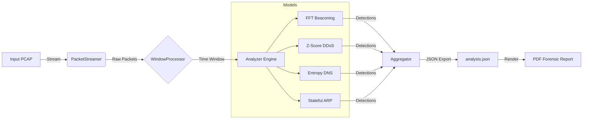

# 🦈 Z-Shark: Mathematical Network Forensics Platform


<p align="center">
  
  
  
  
  
  <br>
  
</p>
---
<details>
<summary><strong>Table of Contents</strong></summary>
<ol>
<li><a href="#--%EF%B8%8F-legal-disclaimer-use-responsibly">Legal Disclaimer</a></li>
<li><a href="#---architectural-philosophy-math-over-signatures">Architectural Philosophy</a></li>
<li><a href="#--%EF%B8%8F-detection-engines-feature-deep-dive">Detection Engines (Deep Dive)</a></li>
<li><a href="#--%EF%B8%8F-system-architecture-and-data-flow">System Architecture</a></li>
<li><a href="#-%EF%B8%8F-installation-and-setup-">Installation & Setup</a></li>
<li><a href="#--usage-guide-">Usage Guide</a></li>
<li><a href="#-%EF%B8%8F-license-">License</a></li>
</ol>
</details>

<h2 style="color: #FF0000; border-bottom: 2px solid #FF0000; padding-bottom: 10px;">
  ⚠️ Legal Disclaimer: Use Responsibly
</h2>

> This tool is intended **strictly for educational purposes, forensic analysis, and defensive security assessments**. Z-Shark provides deep insight into network traffic patterns using advanced statistical models. The author (`Delta-Security`) is not responsible for any misuse of this tool on unauthorized networks. By using this software, you agree to do so in compliance with all applicable laws.

---

<h2 style="color: #007ACC; border-bottom: 2px solid #007ACC; padding-bottom: 10px;">
  💡 Architectural Philosophy: Math Over Signatures
</h2>

**Z-Shark** is not a traditional IDS that relies on static signatures. Instead, it is a **Mathematical Network Forensics Platform** designed to detect anomalies that evade standard rule-based systems. It leverages **Signal Processing (FFT)**, **Information Theory (Entropy)**, and **Statistical Profiling (Z-Scores)** to identify subtle threat patterns.

### The Professional & Modular Approach

1.  **Streaming Architecture:** Z-Shark slices PCAP streams into time-based chunks, allowing it to analyze massive capture files without exhausting memory.
2.  **Explainable AI (XAI):** Every detection includes a mathematically rigorous `justification` and `evidence` payload, ensuring analysts understand *why* an alert was triggered.
3.  **Global CLI:** Once installed via the Debian package, `zshark` becomes a native system command accessible from any directory.

---

<h2 style="color: #FFC107; border-bottom: 2px solid #FFC107; padding-bottom: 10px;">
  ⚙️ Detection Engines: Feature Deep Dive
</h2>

Z-Shark includes a suite of specialized detection models:

### 1. C2 Beaconing Detection (`BeaconingDetector`)
* **Mechanism:** Tracks the **Inter-Arrival Times (IAT)** of packets and applies **Fast Fourier Transform (FFT)**.
* **Math Used:** `numpy.fft.fft` calculates the magnitude spectrum.
* **Trigger:** A significant peak in the frequency spectrum indicates automated communication typical of malware beacons.

### 2. Volumetric Anomaly & DDoS (`DDoSDetector`)
* **Math Used:** * **Z-Score:** Measures standard deviations from the historical mean to catch volume spikes.
    * **Shannon Entropy:** Monitors Source IP randomness; a sudden drop suggests a concentrated flood.

### 3. DGA & DNS Tunneling (`DNSAnomalyDetector`)
* **Mechanism:** Analyzes lexical properties of queried domain names.
* **Math Used:** **Shannon Entropy** applied to character distribution to detect Domain Generation Algorithms.

---

<h2 style="color: #9C27B0; border-bottom: 2px solid #9C27B0; padding-bottom: 10px;">
  🏛️ System Architecture and Data Flow
</h2>

| Component | Responsibility |
| :--- | :--- |
| **Packet Streamer** | Lazy-loading of PCAP files to minimize RAM usage. |
| **Window Processor** | Slices the packet stream into time windows for temporal analysis. |
| **Analysis Engine** | Applies loaded models to each window. |
| **Reporting Engine** | Renders professional PDF forensics reports from JSON data. |


<h2 style="color: #4CAF50; border-bottom: 2px solid #4CAF50; padding-bottom: 10px;"> 🛠️ Installation and Setup </h2>

### Recommended: Debian Package (.deb)
The easiest way to install Z-Shark on Kali Linux or any Debian-based system:

```bash
sudo apt update
sudo apt install ./zshark_2.1.1_all.deb
```

<h2 style="color: #4CAF50; border-bottom: 2px solid #4CAF50; padding-bottom: 10px;"> 🛠️ Installation and Setup </h2>

### Installation (Development Mode)
If you want to run it from source or contribute to the project:

1) **Clone the Repository:**

```bash
git clone [https://github.com/Delta-Security/z-shark.git](https://github.com/Delta-Security/z-shark.git)
cd z-shark
```

2) **Install Dependencies:** Z-Shark relies on heavy scientific computing libraries (`numpy`, `scipy`, `pandas`).

```bash
python -m venv .venv

source .venv/bin/activate  # Linux/macOS

pip install -r requirements.txt
```

<h2 style="color: #00BCD4; border-bottom: 2px solid #00BCD4; padding-bottom: 10px;"> 🚀 Usage Guide </h2>

Z-Shark is driven by a powerful Typer-based CLI (zshark/cli/main.py).

1) **Analyze a PCAP File**
Run the full suite of mathematical models on a capture file.

```bash
zshark analyze capture.pcap -o results/ -v

python -m zshark.cli.main analyze capture.pcap --out-dir results/ #(Development Mode)
```
  * **Output:** Generates a raw `analysis.json` containing all window stats and detection evidence.

2) **Generate Forensic Report**

Convert the JSON analysis into a human-readable PDF.

```bash
zshark report results/analysis.json -o Forensic_Report.pdf

python -m zshark.cli.main report results/capture_analysis.json --pdf-path report.pdf #(Development Mode)
```
 * **Output:** A professional PDF report with charts, evidence tables, and justifications.


3) **Quick Statistical Summary**

(Placeholder/Beta) Get a quick overview of top talkers and protocols.

```bash
zshark summary results/analysis.json --top 10

python -m zshark.cli.main summary capture.pcap --top 10 #(Development Mode)
```

<h2 style="color: #FF5722; border-bottom: 2px solid #FF5722; padding-bottom: 10px;"> ⚖️ License </h2>

This project is licensed under the **MIT License** - see the [`LICENSE`](https://github.com/Delta-Sec/Z-Shark/blob/main/LICENSE) file for details.

Developed by Delta-Sec | Mathematics meets Cybersecurity GitHub: [github.com/Delta-Sec](https://github.com/Delta-Sec)
