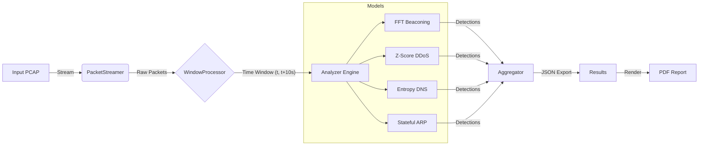

# 🦈 Z-Shark: Mathematical Network Forensics Platform


<p align="center">
  
  
  
  
  
  <br>
  
</p>

---

<details>
<summary><strong>Table of Contents</strong></summary>
<ol>
<li><a href="#--legal-disclaimer-use-responsibly">Legal Disclaimer</a></li>
<li><a href="#--architectural-philosophy-math-over-signatures">Architectural Philosophy</a></li>
<li><a href="#--detection-engines-feature-deep-dive">Detection Engines (Deep Dive)</a></li>
<li><a href="#--system-architecture-and-data-flow">System Architecture</a></li>
<li><a href="#--installation-and-setup">Installation & Setup</a></li>
<li><a href="#--usage-guide">Usage Guide</a></li>
<li><a href="#--license">License</a></li>
</ol>
</details>

<h2 style="color: #FF0000; border-bottom: 2px solid #FF0000; padding-bottom: 10px;">
  ⚠️ Legal Disclaimer: Use Responsibly
</h2>

> This tool is intended **strictly for educational purposes, forensic analysis, and defensive security assessments**. Z-Shark provides deep insight into network traffic patterns using advanced statistical models. The author (`Delta-Security`) is not responsible for any misuse of this tool on unauthorized networks. By using this software, you agree to do so in compliance with all applicable laws.

---

<h2 style="color: #007ACC; border-bottom: 2px solid #007ACC; padding-bottom: 10px;">
  💡 Architectural Philosophy: Math Over Signatures
</h2>

**Z-Shark** is not a traditional IDS that relies on static signatures. Instead, it is a **Mathematical Network Forensics Platform** designed to detect anomalies that evade standard rule-based systems. It leverages **Signal Processing (FFT)**, **Information Theory (Entropy)**, and **Statistical Profiling (Z-Scores)** to identify subtle threat patterns.

### The "CLI-First" & Modular Approach

1.  **Streaming Architecture:** Z-Shark uses a `WindowProcessor` to slice PCAP streams into time-based chunks, allowing it to analyze massive capture files without exhausting memory.
2.  **Explainable AI (XAI):** Every detection includes a mathematically rigorous `justification` and `evidence` payload (e.g., "Peak Magnitude: 0.85"), ensuring analysts understand *why* an alert was triggered.
3.  **Decoupled Reporting:** Analysis logic is separated from presentation. Raw detection data is serialized into JSON first, then rendered into professional PDF reports via `ReportLab`.

---

<h2 style="color: #FFC107; border-bottom: 2px solid #FFC107; padding-bottom: 10px;">
  ⚙️ Detection Engines: Feature Deep Dive
</h2>

Z-Shark includes a suite of specialized detection models located in `zshark/models/`. Each model targets a specific class of network threat using pure mathematics.

### 1. C2 Beaconing Detection (`BeaconingDetector`)
Detects covert Command & Control (C2) channels hidden in regular traffic.

* **Mechanism:** Tracks the **Inter-Arrival Times (IAT)** of packets and applies **Fast Fourier Transform (FFT)** to convert the time-domain signal into the frequency domain.
* **Math Used:** `numpy.fft.fft` calculates the magnitude spectrum.
* **Trigger:** A significant peak in the frequency spectrum indicates periodic (automated) communication typical of malware beacons, distinguishing it from human jitter.

### 2. Volumetric Anomaly & DDoS (`DDoSDetector`)
Identifies high-volume attacks and Low-and-Slow anomalies.

* **Mechanism:** Maintains a sliding window history of **PPS (Packets Per Second)** and **Source IP Entropy**.
* **Math Used:**
    * **Z-Score (Standard Score):** Calculates how many standard deviations the current traffic volume is from the historical mean (`(current - mean) / std_dev`).
    * **Shannon Entropy:** Monitors the randomness of Source IPs. A sudden drop in entropy suggests a flood from a limited number of sources (or a single spoofer).

### 3. DGA & DNS Tunneling (`DNSAnomalyDetector`)
Detects Domain Generation Algorithms (DGA) used by botnets.

* **Mechanism:** Analyzes the lexical properties of queried domain names within a time window.
* **Math Used:** **Shannon Entropy** (`-sum(p * log2(p))`) applied to the distribution of domain name lengths.
* **Trigger:** A statistical deviation (low entropy or abnormal character distribution) in DNS queries triggers a "DGA Suspect" alert.

### 4. L2/L3 Threat Detection (`ARPSpoofDetector` & `PortScanDetector`)
Handles local network attacks and reconnaissance.

* **ARP Spoofing:** Monitors `ARP` packets to track **MAC-to-IP mappings**. Alerts if a MAC address suddenly claims an IP belonging to another MAC, or if excessive "Gratuitous ARP" packets are observed.
* **Port Scanning:** Uses a `defaultdict` counter to track unique destination ports accessed by a single source IP. Alerts based on a threshold of unique ports/packets ratio.

---

<h2 style="color: #9C27B0; border-bottom: 2px solid #9C27B0; padding-bottom: 10px;">
  🏛️ System Architecture and Data Flow
</h2>

The architecture is designed for high throughput and modularity.

| Component | Tech Stack | Responsibility |
| :--- | :--- | :--- |
| **Packet Streamer** | `Scapy PcapReader` | Lazy-loading of large PCAP files to minimize RAM usage. |
| **Window Processor** | `zshark.core.processor` | Slices the packet stream into time windows (e.g., 10s chunks) for temporal analysis. |
| **Analysis Engine** | `zshark.models` | Applies loaded models (`BaseDetectionModel` subclasses) to each window. |
| **Reporting Engine** | `ReportLab`, `JSON` | Serializes `AnalysisResult` objects and renders PDF forensics reports. |

### Data Processing Pipeline



<h2 style="color: #4CAF50; border-bottom: 2px solid #4CAF50; padding-bottom: 10px;"> 🛠️ Installation and Setup </h2>

### Prerequisites
* **Python 3.11+** (Required for latest scientific libraries).

*  **Poetry** (Recommended) or pip.

### Installation
1) **Clone the Repository:**
```bash
git clone [https://github.com/Delta-Security/z-shark.git](https://github.com/Delta-Security/z-shark.git)
cd z-shark
```
2) **Install Dependencies:** Z-Shark relies on heavy scientific computing libraries (`numpy`, `scipy`, `pandas`).
```bash
python -m venv .venv
source .venv/bin/activate  # Linux/macOS
# or .venv\Scripts\activate on Windows

pip install -r requirements.txt
```

<h2 style="color: #00BCD4; border-bottom: 2px solid #00BCD4; padding-bottom: 10px;"> 🚀 Usage Guide </h2>

Z-Shark is driven by a powerful Typer-based CLI (zshark/cli/main.py).

1) **Analyze a PCAP File**
Run the full suite of mathematical models on a capture file.

```bash
# Basic Analysis
python -m zshark.cli.main analyze capture.pcap --out-dir results/

# High-Performance Mode (Parallel Workers)
python -m zshark.cli.main analyze huge_traffic.pcap --parallel 4 --profile deep-scan
```
  * **Output:** Generates a raw analysis.json containing all window stats and detection evidence.

2) **Generate Forensic Report**
Convert the JSON analysis into a human-readable PDF.

```bash
python -m zshark.cli.main report results/capture_analysis.json --pdf-path report.pdf
```
 * **Output:** A professional PDF report with charts, evidence tables, and justifications.

3) **Quick Statistical Summary**
(Placeholder/Beta) Get a quick overview of top talkers and protocols.

```bash
python -m zshark.cli.main summary capture.pcap --top 10
```

<h2 style="color: #FF5722; border-bottom: 2px solid #FF5722; padding-bottom: 10px;"> ⚖️ License </h2>

This project is licensed under the **MIT License** - see the [`LICENSE`](https://github.com/Delta-Sec/Z-Shark/blob/main/LICENSE) file for details.

Developed by Delta-Sec | Mathematics meets Cybersecurity GitHub: [github.com/Delta-Sec](https://github.com/Delta-Sec)
